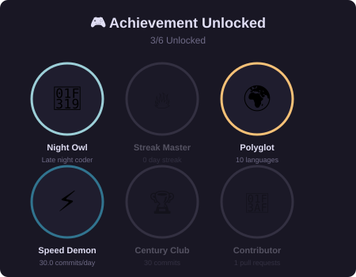
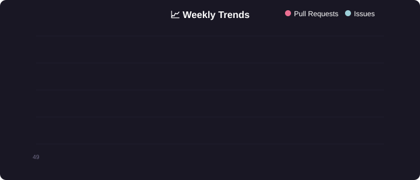

### Backend Engineer (Go & Python) | Cloud & MLOps | AWS | Kubernetes
  
_Focused on building high-performance, scalable backend systems and MLOps pipelines._

_Creator of the [Nexus](https://github.com/DannyahIA/nexus) real-time chat._

 

<!-- METRICS_START -->

<!-- DASHBOARD: Visual Analytics -->

## 📊 GitHub Analytics Dashboard

<!-- Row 1: Full-width Stats Card -->

 

<!-- Row 2: Two-column layout - Tier Ranking + Languages -->
<table>
<tr>
<td width="50%" valign="top">

### 🏆 Project Tiers

</td>
<td width="50%" valign="top">

### 💻 Language Stack

</td>
</tr>
</table>

 

<!-- Row 3: Two-column layout - Recent Activity + Achievements -->
<table>
<tr>
<td width="50%" valign="top">

### 🚀 Latest Activity

</td>
<td width="50%" valign="top">

### 🎮 Achievements

</td>
</tr>
</table>

 

<!-- Row 4: Full-width Repository Grid -->
### 🗂️ Featured Repositories

<!-- METRICS_END -->

 

<!-- RANKINGS_START -->

<b>📈 Advanced Analytics (Click to expand)</b>

 

### 📊 Comparative Performance

 

### 📉 Trends & Patterns

 

### 🎯 Distribution Analysis

<table>
<tr>
<td align="center" width="50%">

</td>
<td align="center" width="50%">

</td>
</tr>
</table>

 

### 🏅 Project Tier Evolution

<!-- RANKINGS_END -->

 

## 🛠️ My Tech Stack

My philosophy is to use the right tool for the job, with a special focus on performance and scalability.

### Core Backend & MLOps (My Expertise)

### Full-stack & Secondary

### Niche & Legacy Experience

 

## 🎯 Current Focus & Roadmap

I'm always building and learning. My current focus is on:

- **1. Project "P2P Assist":** Building a P2P support platform with Go, WebRTC, and deploying it on Kubernetes.
- **2. CKAD Certification:** Actively preparing for the **Certified Kubernetes Application Developer (CKAD)** certification.
- **3. MLOps:** Deepening my knowledge of MLOps pipelines, serving AI models with high performance.

 

## 🤝 Let's Connect

I'm always open to new challenges and collaborations.

  

    

    

 

_Last updated: January 26, 2026 at 00:00 UTC_

**✨ This README is automatically updated daily with GitHub activity metrics and visualizations ✨**

