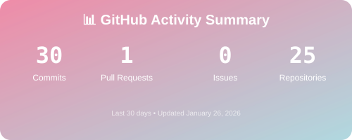
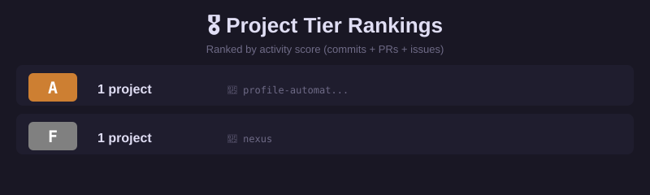
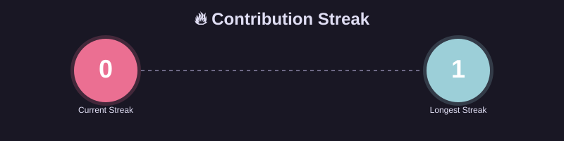

# 📊 Profile Automation

> Sistema inteligente de automação que coleta, processa e visualiza suas métricas do GitHub automaticamente.

## 🎯 O Que Este Sistema Faz?

Este projeto automatiza completamente seu perfil do GitHub:

- 🤖 **Coleta automática** de dados (repos públicos + privados)
- 📊 **Calcula métricas** em tempo real (commits, PRs, issues, streak)
- 🏆 **Gera rankings** de projetos por atividade, stars, linguagem
- 📝 **Atualiza README** automaticamente todo dia
- 📈 **Mantém histórico** para análises futuras
- 🔮 **Preparado para IA** (relatórios semanais futuros)

## 🚀 Como Começar

**Leia primeiro:** [`GITHUB_ACTIONS.md`](GITHUB_ACTIONS.md) - Setup completo em 3 passos!

**Resumo rápido:**

1. Push este código para o GitHub
2. Adicione seu token nas Secrets
3. Rode o workflow manualmente
4. Pronto! Seu README se atualiza sozinho 🎉

## 📈 Métricas em Tempo Real

<!-- METRICS_START -->

### 📊 Project Rankings

### 🗂️ Top Repositories

<b>📈 View Detailed Stats</b>

 

<table align="center">
<tr>
<td align="center" width="50%">

**This Month**

📝 `13` commits  
🔀 `0` pull requests  
✅ `0` issues  

</td>
<td align="center" width="50%">

**Contribution Streak**

🔥 `1` days current  
🏆 `1` days record  

</td>
</tr>
</table>

<!-- METRICS_END -->

## 📅 Resumo Semanal

<!-- WEEKLY_START -->
*Nenhum relatório semanal ainda.*
<!-- WEEKLY_END -->

## 🏆 Top Projetos

<!-- RANKINGS_START -->

## 🏆 Featured Projects

<b>� View All Projects</b>

 

- 🔒 **[profile-automation](https://github.com/DannyahIA/profile-automation)** • C • Python • ⚡ 13
- 📂 **[orkut](https://github.com/DannyahIA/orkut)** • F • PHP • ⚡ 2
- 📂 **[nexus](https://github.com/DannyahIA/nexus)** • F • TypeScript • ⚡ 1

<b>🚀 Recent Work</b>

 

- 🔒 **profile-automation** • Python • _today_
- 📂 **DannyahIA** • Various • _today_
- 📂 **nexus** • TypeScript • _4d ago_
- 📂 **orkut** • PHP • _4w ago_
- 🔒 **mc-msg-sync** • JavaScript • _1mo ago_

<!-- RANKINGS_END -->

## 📖 Histórico

<!-- HISTORY_START -->
*Histórico será preenchido automaticamente.*
<!-- HISTORY_END -->

---

## 📚 Documentação

- 📘 **[GITHUB_ACTIONS.md](GITHUB_ACTIONS.md)** - Setup e configuração (COMECE AQUI!)
- 🏗️ **[ARCHITECTURE.md](ARCHITECTURE.md)** - Como o sistema funciona (explicado!)
- 📖 **[SETUP.md](SETUP.md)** - Guia completo e detalhado
- 🧪 **[TESTING.md](TESTING.md)** - Para quem quer testar localmente

## 🛠️ Tecnologias

- **Python 3.11+** - Linguagem principal
- **PyGithub** - Acesso à API do GitHub
- **GitHub Actions** - Automação e CI/CD
- **JSON** - Armazenamento de dados

## 🎨 Features Futuras

- [ ] 🤖 Relatórios semanais gerados por IA
- [ ] 📅 Resumos mensais com timeline
- [ ] 📊 Gráficos SVG dinâmicos
- [ ] 🔥 Heatmap de atividade
- [ ] 🎯 Badges customizados
- [ ] 🌐 Integração com GitLab/Bitbucket

## 🤝 Contribuindo

Contribuições são bem-vindas! Sinta-se livre para:

- 🐛 Reportar bugs
- 💡 Sugerir features
- 🔧 Enviar pull requests
- 📖 Melhorar documentação

## 📄 Licença

MIT License - use e modifique à vontade!

---

*Última atualização: 26/01/2026 às 17:55 UTC*
