# 📊 GitHub Analytics Dashboard

*🤖 Automated GitHub portfolio • Updated daily via GitHub Actions*

---

## 🎯 Overview

<table>
  <tr>
    <td width="50%">
      
    </td>
    <td width="50%">
      
    </td>
  </tr>
  <tr>
    <td width="50%">
      
    </td>
    <td width="50%">
      
    </td>
  </tr>
</table>

---

## 📈 Detailed Analytics

### 💻 Language Distribution

### 🔥 Contribution Heatmap

### 📊 Streak Analytics

---

## 🏆 Featured Repositories

<table>
  <tr>
    <td>
      
    </td>
  </tr>
  <tr>
    <td>
      
    </td>
  </tr>
  <tr>
    <td>
      
    </td>
  </tr>
</table>

---

## 🛠️ Tech Stack

---

## 📫 Connect with Me

---

### � About This Dashboard

This profile is automatically updated every day using **GitHub Actions**.  
All visualizations are generated as interactive SVG components using Python.

**Technologies:** Python • SVG • GitHub API • GitHub Actions • JSON

---

*📅 Last Update: Automated daily at 00:00 UTC*  
*🤖 Generated by [profile-automation](https://github.com/DannyahIA/profile-automation)*

⭐ Star this repository if you find it useful!

